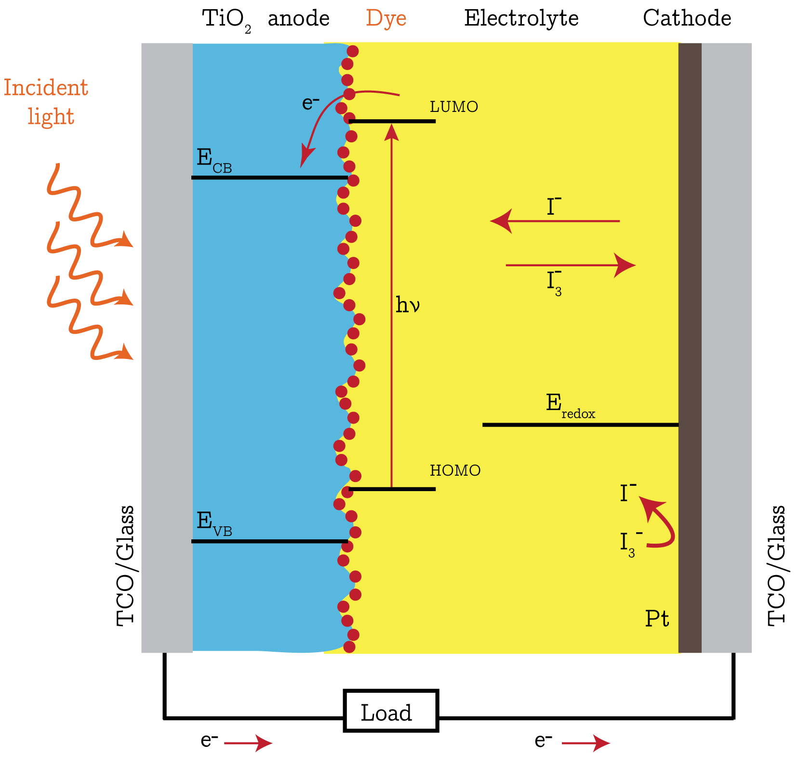
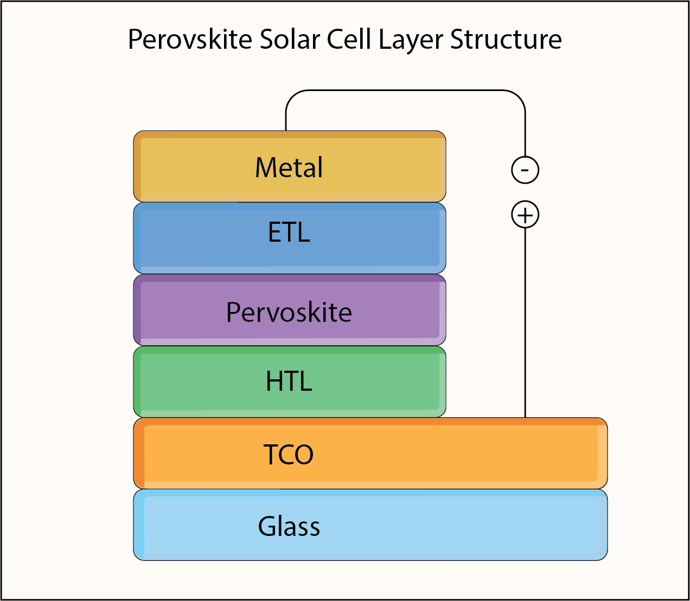
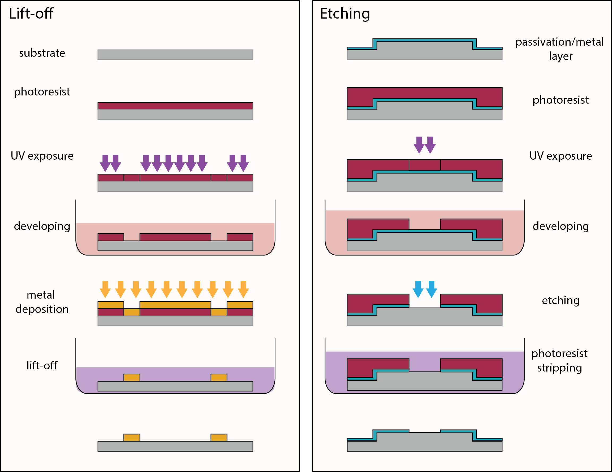
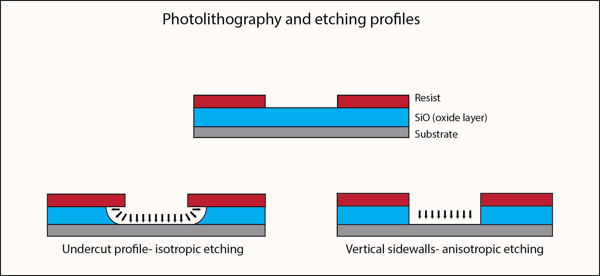
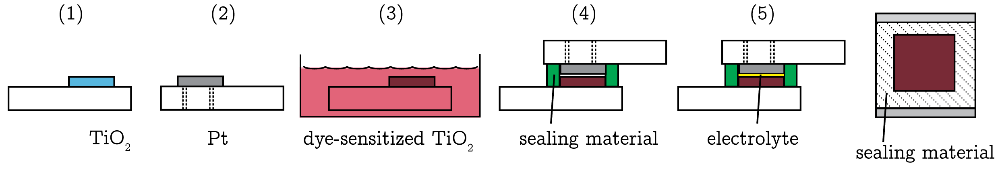
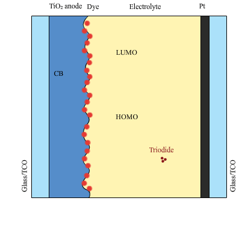
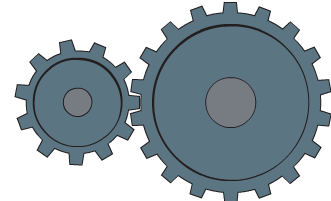

# Wissal Alayashi, PhD  
*STEM Animations & Technical Illustrations for Science and Engineering Education*  

---

## 📘 About  
I create clear, engaging **scientific illustrations and animations** to make complex STEM concepts accessible for students, educators, and publishers.  
Special focus: **semiconductors, photovoltaics, display technologies, and microfabrication processes.**

---

## 🖼️ Semiconductor Diagrams  

**DSSC Energy Band**  
 

*Illustrates electron–hole separation and charge transport in dye-sensitized solar cells. Designed to support instruction in renewable energy and semiconductor physics.*  

**Perovskite Structure**  
 

*Highlights the layered structure of perovskite solar cells. Useful for understanding material interfaces and photovoltaic design.*  

**Lift-off vs. Etching**  
  
*Side-by-side comparison of two photolithography-based patterning techniques. The lift-off process demonstrates how a deposited metal layer is patterned by dissolving photoresist, while the etching process shows selective material removal after UV exposure and development. Useful for teaching semiconductor device fabrication methods.*  

**Etching Process**  
  
*Shows the stages of material removal using wet and dry etching. Explains how etching defines micro- and nano-scale features in semiconductor devices.*  

**Cell Assembly**  
  
*Step-by-step illustration of dye-sensitized solar cell (DSSC) assembly. Shows the deposition of TiO₂ and Pt electrodes, dye sensitization, sealing, and electrolyte filling to complete the device structure.*  

---

## 🎬 Animations  
 

**DSSC (Dye-Sensitized Solar Cell) Animation**  
  
*Animated sequence showing how sunlight excites dye molecules, injects electrons into TiO₂, and drives current through the external circuit. Highlights charge transfer, electrolyte regeneration, and energy conversion in dye-sensitized solar cells.*

**Perovskite Solar Cell Animation** 

*Animation of energy band alignment in perovskite solar cells. Helps students visualize how perovskite materials improve light absorption and carrier mobility.*  

**Gear Motion Animation**  
  
*Demonstrates rotational motion and gear ratio concepts. Useful for teaching mechanical systems and basic engineering physics.*  

**Photolithography Process Animation**  
  
*Step-by-step animation of the photolithography process, including photoresist coating, UV exposure, development, and pattern transfer. Helps students visualize how micro- and nano-scale circuit patterns are created in semiconductor fabrication.*  

