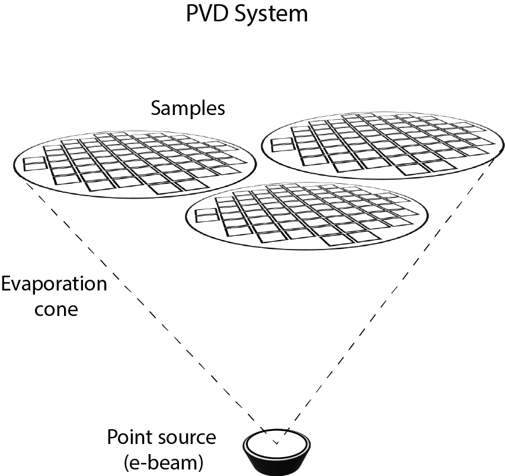

# Wissal Alayashi, PhD  
**NanoSketch Studio**  
*STEM Animations & Technical Illustrations for Science and Engineering Education*  

---

## 📘 About  
I create clear, engaging **scientific illustrations and animations** to make complex STEM concepts accessible for students, educators, and publishers.  
Special focus: **semiconductors, photovoltaics, display technologies, and microfabrication processes.**

---

## 🖼️ Semiconductor Diagrams  

**DSSC Energy Band**  
  

**Perovskite Structure**  
  

**PVD Process**  
  

**Etching Process**  
  

**Cell Assembly**  
  

---

## 🎬 Animations  

✨ *Coming Soon!* ✨  

Here’s where I’ll showcase my STEM animations.  

Example placeholder (replace with your own file once uploaded):  

**Band Gap Animation**  
  

**Perovskite Solar Cell Animation**  

