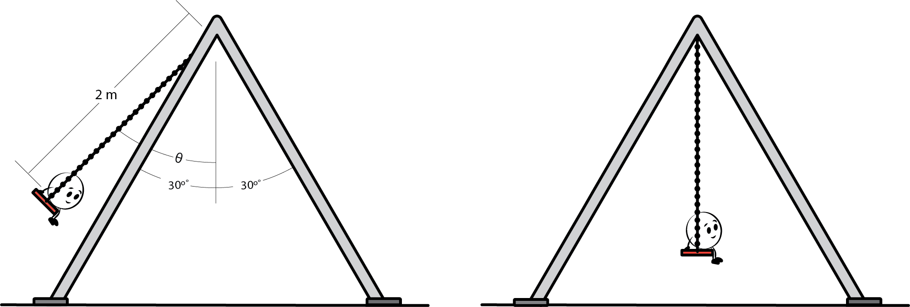

# Wissal Alayashi, PhD  
*STEM Animations & Technical Illustrations for Science and Engineering Education*  

---
## 📘 About  

I create clear, engaging scientific illustrations and animations that make complex STEM concepts accessible for students, educators, and publishers. My portfolio spans topics across physics, renewable energy, materials science, and engineering processes, always with a focus on accuracy and visual clarity.  

---

## 🖼️ Semiconductor Diagrams  

**DSSC Energy Band**  
 

*Illustrates electron–hole separation and charge transport in dye-sensitized solar cells. Designed to support instruction in renewable energy and semiconductor physics.*  

**Lift-off vs. Etching**  
 

*Side-by-side comparison of two photolithography-based patterning techniques. The lift-off process demonstrates how a deposited metal layer is patterned by dissolving photoresist, while the etching process shows selective material removal after UV exposure and development. Useful for teaching semiconductor device fabrication methods.*  

**Etching Process**  

*Shows the stages of material removal using wet and dry etching. Explains how etching defines micro- and nano-scale features in semiconductor devices.*  

**Cell Assembly**  
  
*Step-by-step illustration of dye-sensitized solar cell (DSSC) assembly. Shows the deposition of TiO₂ and Pt electrodes, dye sensitization, sealing, and electrolyte filling to complete the device structure.*  

**Pendulum Motion on a Swing**  
 

*Illustration of a swing modeled as a pendulum with a 2 m chain, oscillating up to ±30° from the vertical. Useful for teaching concepts of simple harmonic motion, angular displacement, and energy transformation in mechanics.*  

---

## 🎬 Animations  
 

**DSSC (Dye-Sensitized Solar Cell) Animation**  
  
*Animated sequence showing how sunlight excites dye molecules, injects electrons into TiO₂, and drives current through the external circuit. Highlights charge transfer, electrolyte regeneration, and energy conversion in dye-sensitized solar cells.*

**Perovskite Solar Cell Animation** 

*Layers (top→bottom): **Metal** — back electrode; **ETL** — electron transport to the electrode; **Perovskite** — light-absorbing active layer; **HTL** — hole transport to the electrode; **TCO** — **transparent conductive oxide** (e.g., ITO or FTO) that is optically transparent and acts as the front electrode for charge collection; **Glass** — rigid, transparent substrate.*  

**Gear Motion Animation**  
  
*Demonstrates rotational motion and gear ratio concepts. Useful for teaching mechanical systems and basic engineering physics.*  

**Photolithography Process Animation**  
  
*Step-by-step animation of the photolithography process, including photoresist coating, UV exposure, development, and pattern transfer. Helps students visualize how micro- and nano-scale circuit patterns are created in semiconductor fabrication.*  

**Semiconductor Bandgap Animation**
  
Animation showing an electron starting in the valence band and being excited across the bandgap into the conduction band when sufficient energy (hν) is absorbed. The transition illustrates how charge carriers are generated in semiconductors, forming the basis of electronic and optoelectronic device operation.

